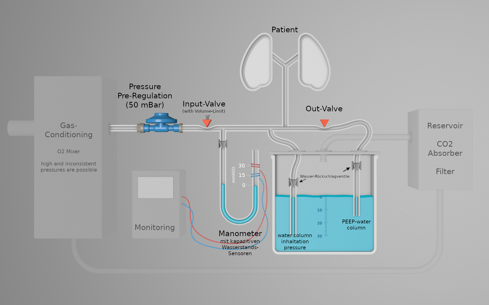
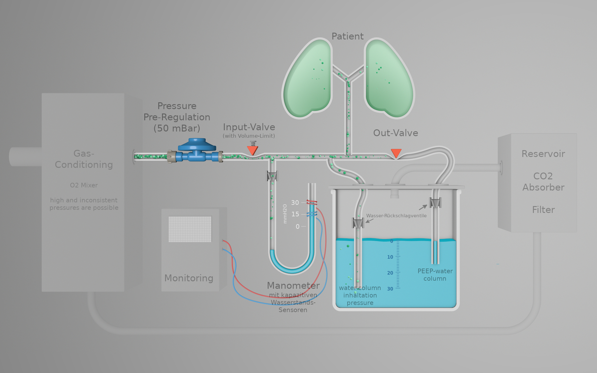
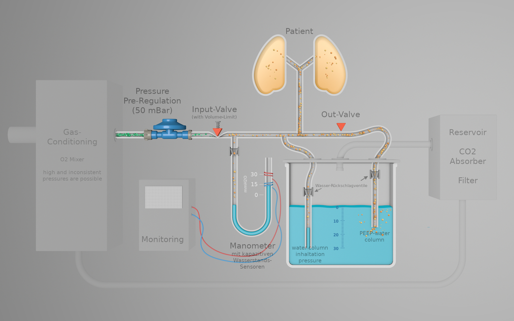
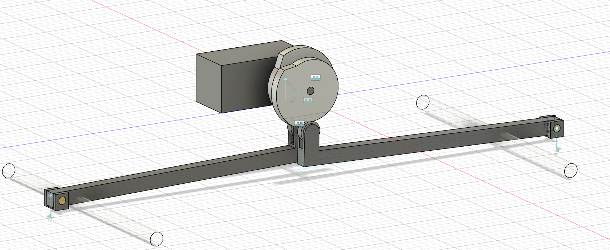
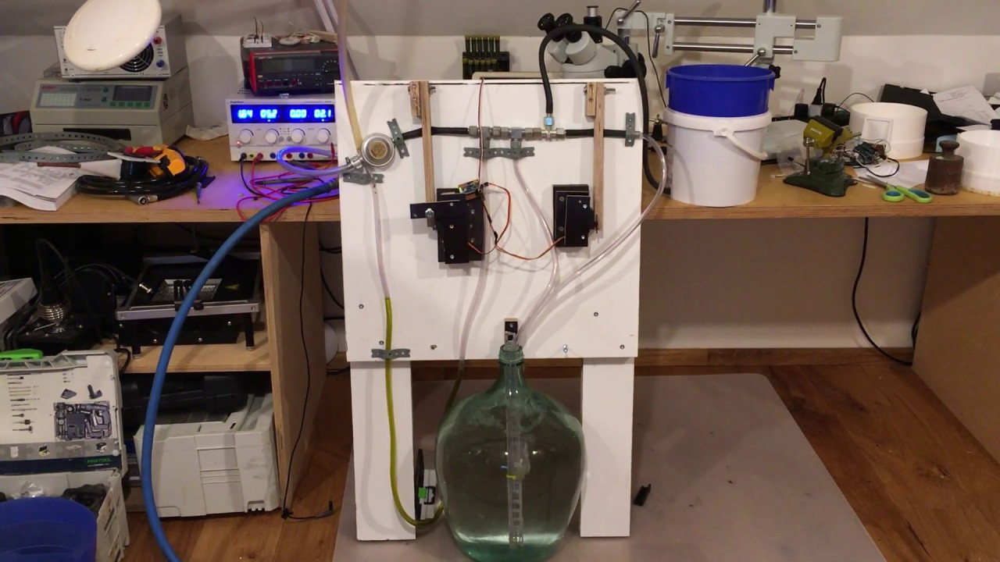

# YACoVV - Yet Another (SARS-)CoV(-2)Ventilator

[German-Version is more Detailed / updated more frequently](README_DE.md) <- Please translate (see Contributing)!

[Spanish Version](README_ES.md)

This project aims at constructing components for the production of ventilators that can be used as last-resort-solutions for SARS-CoV-2 patients. 

All components should be constructed with parts, raw materials and skills needed in the places in which the devices come into use. 

The most complex component of a ventilator is the correct, reliable and safe pressure control of the ventilator as well as keeping the positive end-expiratory pressure intact. Currently, there is a promising solution for the pressure control that has already been transferred into a functioning sample.

The components are:
- [Pressure regulator and timing](#Pressure%20regulator)
    - Regulation of the ventilation pressure
    - Upholding the modifiable PEEP
    - Regulation of modifiable Breath Frequency
    - Regulation of modifiable I:E relation
- [Monitoring](MONITORING_DE.md) (please Translate!)
    - Measurement of volume
    - Measurement of pressure
    - Measurement of frequency
- [Respiratory gas/ Processing](#Breath%20gas%20production)
    - ozone/oxygen mixture
    - Recovery
        - Co2-absorber 
    - Heating 
    - Humidification

[miro-Board](https://miro.com/app/board/o9J_kuxCsRI=/) (Idea and Link Collection)

## Pressure regulator

### Functional principle

The concept behind the [water column](https://de.wikipedia.org/wiki/Meter_Wassers%C3%A4ule) makes sure pressure regulation functions. To generate modifiable pressures in the system, tubes are immersed into water appropriate to the desired pressure. The control tubes are simultaneously used as relief valve. The “return paths” of the water column are savely secured through check valves so that no water can flow back to the patient.

Because high entrance pressures can only be regulated through this system with very precise component, we decided using a [50 mBar gas pressure regulator](https://www.campingaz.com/DE/p-25990-verstellbarer-regler-30-50-mbar.aspx) to pre-regulate the pressure. These regulations are available all over the world.

We are using the basic principle behind [constriction hose-valves](https://www.ako-armaturen.de/produkte/mechanische-schlauchquetschventile.html) for our valves since these can be easily manufactured out of widely available components. On top of that, these kinds of valves bear the advantage that all components that come into contact with contaminated gas can be replaced. 

#### Inhalation

- The input pressured is reduced to ~ 50 mBar by a [mechanical pressure regulator](https://www.campingaz.com/DE/p-25990-verstellbarer-regler-30-50-mbar.aspx)
- The input valve is opened mechanically. A adjustment screw limit flow-volume. Due to the adjustment screw valves without regulating funtions can be used and gas-loss through the limiting water column is minimized.
- Gas flows towards the patent until the pressure reaches the level set by the wate column. 
#### Exhalation

- The input valve is closed and the output valve opened
- Gas flows from the patient through the PEEP water column into the reservoir
- PEEP can be adjusted by mofing the water column

#### System-Safety
- Over-Pressurizing is practically impossible in the system as the pressure is only closed by water columns. No mechanical parts restrict the pressure.
- There are no mechanical parts that cna get stuck
- Losing PEEP is only possible when there are leaks
- check valves ensure that no water can flow towards the patient

#### Valve-Control and Timing

The timing currently functions through a microcontroller and two servos. This solution will replaced with the motor of a windscreen wiper with two [camdiscs](https://en.wikipedia.org/wiki/Cam).

[Camdisc Animation](https://autode.sk/3dx6EbZ)

### Functional Prototype

Problems with this prototype:
- [Lack of check valves](https://github.com/auenkind/YACoVV/issues/3)
- [Air bubbles in discharge hose too big](https://github.com/auenkind/YACoVV/issues/1)
- [Servo/Microtroller](https://github.com/auenkind/YACoVV/issues/2)

## Breath gas production
This component reuses the exhaled breath gas. Co2 is absorbed and oxygen is mixed in.

## Contributing
We are happy about every contribution to this project! We need action NOW! Please don’t overthink your contribution, join us!

If these projects’ solutions win prizes in competitions such as the [Code Life Ventilator Challenge](https://www.agorize.com/en/challenges/code-life-challenge?lang=en), we will use the money to construct the components or improve the design.

Things everyone can do:
- Translation of the README_DE.md in as many languages as possible. Translations will have be adjusted very frequently, changes should quickly be translated.
- Construct a YACoVV und run it! Feedbacks on the materials used and problems that have come up would be awesome!
- Take on one of the concrete problems in the issue section.
