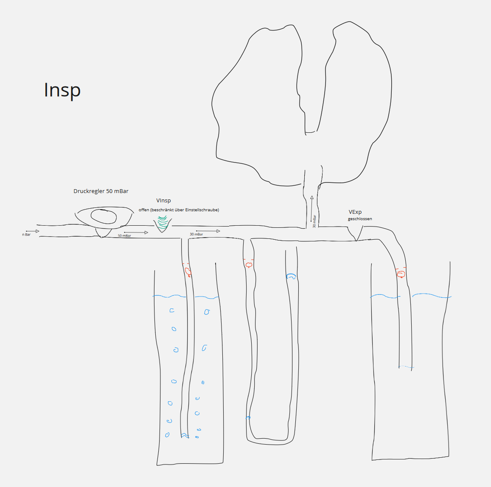
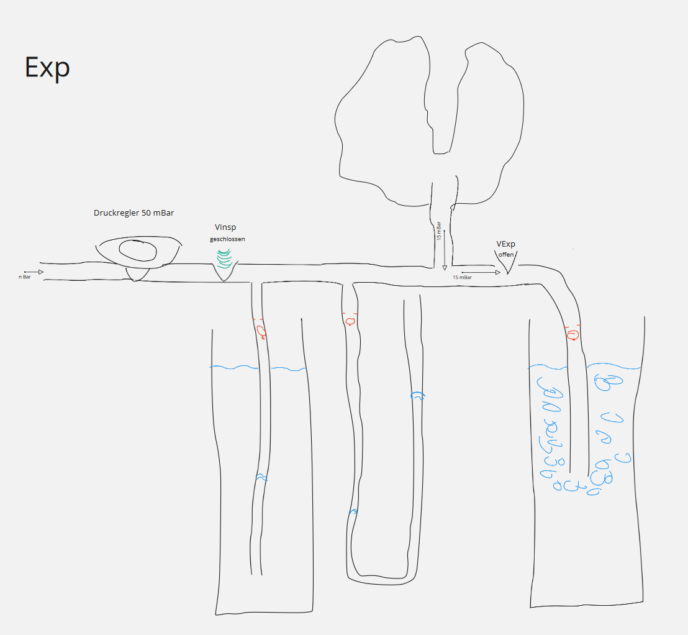

# YACoVV - Yet Another (SARS-)CoV(-2)Ventilator

Dieses Projekt hat zum Ziel Baugruppen zum Bau von Beatmungsgeräten zu Konstruieren die als "last resort" Geräte für SARS-CoV-2 Patienten eingesetzt werden können.

Alle Baugruppen sollten wo immer möglich mit Bauteilen, Rohmaterialien und Fertigkeiten hergestellt werden können die dort vorhanden sind wo die Geräte gebraucht werden.

Der komplexeste Teil eines Beatmungsgerätes ist die korrekte, zuverlässige und sichere Druckregelung des Beatmungsdrucks und das halten des PEEP. Aktuell gibt es für die Druckregelung einen vielversprechenden Lösungsansatz der bereits in einem funktionierenden Muster aufgebaut wurde.

Geplante Baugruppen sind:

- [Druckregler und Taktgebung](#Druckregler)
    - Regelung des einstellbaren Beatmungsdrucks
    - Halten des einstellbaren PEEP
    - Regelung der einstellbaren Beatmungsfrequenz
    - Regelung des einstellbaren I:E verhältnisses

- [Atemgas-Erzeugung / Aufbereitung](#Atemgaserzeugung)
    - Sauersoffmischung
    - Rückgewinnung
        - Co2-Absorber
    - Heizung
    - Anfeuchtung
- [Monitoring](#Monitoring)
    - Volumenmessung
    - Druckmessung
    - Frequenzmessung

[miro-Board](https://miro.com/app/board/o9J_kuxCsRI=/) (Ideen and Link-Sammlung)

## Druckregler
### Prototyp Video
https://www.youtube.com/watch?v=eBIlyaHW4l0
### Funktionsprinzip

Die Druckregelung funktioniert über das simple und sichere Prinzip der Wassersäule. Zur Erzeugung von einstellbaren Drücken im System werden Schläuche auf eine dem gewünschten Druck entsprechende Tiefe in Wasser eingetaucht. Die Regelschläuche funktionieren dabei gleichzeitig als Überdruckventil. Die "Rückwege" der Wassersäulen werden mit Rückschlageventilen abgesichert so das kein Wasser zum Patienten gelangen kann.

Da sich hohe Eingangdrücke über dieses System nur mit sehr genauen Komponenten Regeln lassen verwenden wir einen 50 mBar Gasdruckregler zur Vorregelung des Drucks. Da diese Regler in großen Stückzahlen auf der ganzen Welt verfügbar sind stellen Sie eine ideale Lösung für unsere Problemstellung dar.

Als Ventile verwenden wir das Prinzip von [Schlauchquetschventilen](https://www.ako-armaturen.de/produkte/mechanische-schlauchquetschventile.html) da derartige Ventile aus einer Vielzahl von weit verfügbaren Komponenten einfach zusammengebaut werden können. Zusätzlich bietet diese Ventilart den Vorteil des einfachen Austauschs aller Komponenten die mit kontaminierten Gas Berührung kommen.

Die Taktgebung erfolgt im aktuellen Prototyp über einen Mikrocontroller und zwei Servos. Diese Lösung wird durch einen Scheibenwischermotor mit zwei [Kurvenscheiben](https://de.wikipedia.org/wiki/Kurvenscheibe) ersetzt werden.

#### Inhalation

#### Exhalation

## Atemgaserzeugung
Diese Baugruppe gewinnt das ausgeatmete Atemgas zurück. Co2 muss absorbiert und Sauerstoff beigemischt werden können.

## Monitoring
Diese Baugruppe überwacht die Drucklevel, den Pendeldruck und die Frequenz während der Beatmung.

## Contributing
Wir freuen uns über jeden Beitrag zum Projekt! Alles muss JETZT sofort passieren. Bitte denkt nicht darüber nach etwas beizutragen macht es!

Wenn das Ergebnis dieses Projektes in Wettbewerbe wie der [Code Life Ventilator Challenge](https://www.agorize.com/en/challenges/code-life-challenge?lang=en) Preisgelder gewinnen sollte, werden diese zum Bau der Komponenten oder zur verbesserung des Designs verwendet.

Dinge die aktuell jeder Beitragen kann

- Übersetzung der README_DE.md (aktuelle Datei) in so viele Sprachen wie möglich. Die Datei wird sich sehr schnell ändern und die Änderungen sollten jeweils möglichst schnell Übersetzt werden.
- Baut einen YACoVV und lasst ihn laufen. Rückmeldungen darüber welche Materialien verwendet werden können und welche Probleme beim Bau auftreten wären großartig.
- Nehmt euch eines konkreten Problems aus den Issues an.