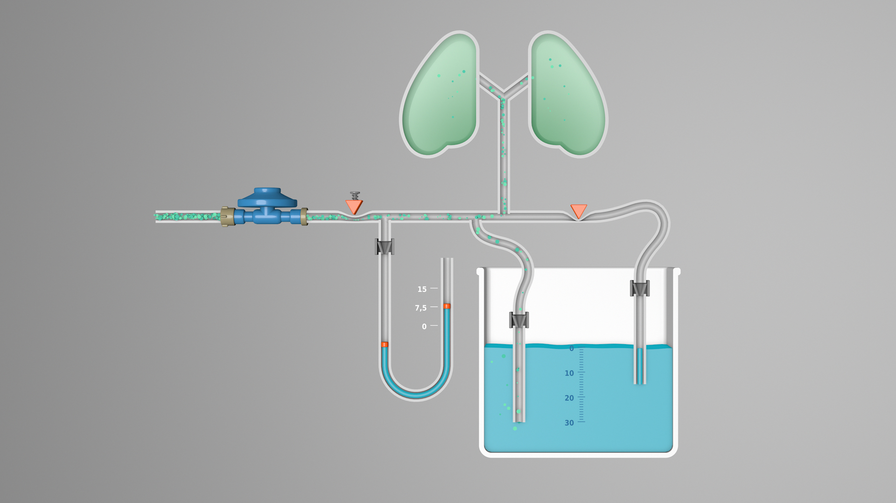
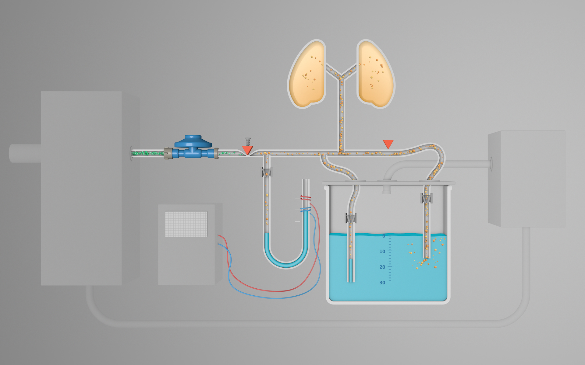

# YACoVV - Yet Another (SARS-)CoV(-2)Ventilator

[Spanish Version](README_ES.md)

[English Version](README_EN.md)

Dieses Projekt hat zum Ziel, Baugruppen zum Bau von Beatmungsgeräten zu Konstruieren, die als "last resort" Geräte für SARS-CoV-2 Patienten eingesetzt werden können.

Alle Baugruppen sollten mit Bauteilen, Rohmaterialien und Fertigkeiten hergestellt werden können die am Einsatzort der Geräte verfügbar sind.

Der komplexeste Teil eines Beatmungsgerätes ist die korrekte, zuverlässige und sichere Druckregelung des Beatmungsdrucks und das halten des [PEEP](https://de.wikipedia.org/wiki/Positiver_endexspiratorischer_Druck). Aktuell gibt es für die Druckregelung Lösungsansatz der bereits in einem funktionierenden Muster aufgebaut ist.

Geplante Baugruppen sind:

- [Druckregler und Taktgebung](#Druckregler)
    - Regelung des einstellbaren Beatmungsdrucks
    - Halten des einstellbaren [PEEP](https://de.wikipedia.org/wiki/Positiver_endexspiratorischer_Druck)
    - Regelung der einstellbaren Beatmungsfrequenz
    - Regelung des einstellbaren I:E verhältnisses

- [Monitoring](MONITORING_DE.md)
    - Volumenmessung
    - Druckmessung
    - Frequenzmessung

- [Atemgas-Erzeugung / Aufbereitung](#Atemgaserzeugung)
    - Sauersoffmischung
    - Rückgewinnung
        - Co2-Absorber
    - Heizung
    - Anfeuchtung

[miro-Board](https://miro.com/app/board/o9J_kuxCsRI=/) (Ideen and Link-Sammlung)

## Druckregler

### Funktionsprinzip

Die Druckregelung funktioniert über das einfache und sichere Prinzip der [Wassersäule](https://de.wikipedia.org/wiki/Meter_Wassers%C3%A4ule). Die zur Beatmung gewünschten Systemdrücke werden mit der Eintauchtiefe der beiden Schläuche reguliert. Die Regelschläuche funktionieren auch als Überdruckventil. Die "Rückwege" der Wassersäulen werden mit Rückschlageventilen versperrt damit kein Wasser zum Patienten gelangen kann.

Um einen großen Bereich unterschiedlichster Atemgas-Eingansdrücke abdecken zu können wird ein [50 mBar Gasdruckregler](https://www.campingaz.com/DE/p-25990-verstellbarer-regler-30-50-mbar.aspx) zur Vorregelung verwendet. Diese Druckregler sind auf der ganzen Welt in großen Stückzahlen verfügbar.

Das System verdendet Ventile nach dem Prinzip von [Schlauchquetschventilen](https://www.ako-armaturen.de/produkte/mechanische-schlauchquetschventile.html) da derartige Ventile aus unterschiedlichsten, einfach verfügbaren Komponenten aufgebaut werden können. Ausserdem ermöglicht diese Ventilart einen einfachen Austauschs aller Komponenten die mit kontaminierten Gasen in Berührung kommen. Diese Teile des Druckregler können vollständig aus Einmalmaterial hergestellt und regelmäßig ausgetauscht werden. 

#### Inhalation

- Der Druck des Atemgases wird mit dem Druckregler auf einen im System einfacher weiterverarbeitbaren Druck gebracht. Es bieten sich 50 mBar an da die entsprechenden Druckregler gut verfügbar sind.
- Das Eingangsventil wird durch die Mechanik geöffnet. Die Einstellschraube begrenzt den Luftfluss. Durch die Begrenzung wird der Einsatz einer Steuerungsmechanik ohne Regelfunktionen ermöglicht und der Verlust von Atemgas durch die Regelfunktion der Wassersäule minimiert.
- Das Atemgas fließt zum Patienten, übersteigt der Druck den mittels der Eintauchtiefe der Beatmungsdrucksäule festgelegten Wert fließt überschüssiges Gasvolumen durch die Wassersäule ab. Gleichzeitig kann über die Blasenbildung kontrolliert werden ob der eingestellte Druck während des Vorgangs erreicht wird.

#### Exhalation

- Das Eingangsventil wird geschlossen und das Ausgangsventil geöffnet.
- Das Atemgas fließt durch die PEEP-Drucksäule ins Reservoir
- Durch die Eintauchtiefe kann der PEEP nie unter den eingestellten Wert fallen

#### Systemsicherheit

Durch die Nutzung der [Wassersäulen](https://de.wikipedia.org/wiki/Meter_Wassers%C3%A4ule) ergibt sich gegenüber anderen Druckregelungssystemen eine sehr hohe Systemsicherheit.

- Die Erzeugung eines Überdrucks oberhalb der eingestellten Wassersäule ist beinahe unmöglich
- Die Druckregelung enthält keinerlei mechanische Teile die verklemmen / verkleben können dem Verschleiß der Ventilschläuche kann durch regelmäßigen austausch vorgebeugt werden.
- Husten / Atmung durch den Patienten hat keinen Einfluss auf die Systemfunktion
- Ein unterschreiten des PEEP ist nur bei undichtem System möglich
- Durch Rückschlagventile wird verhindert das Wasser beim Einatmen durch den Patienten aus den Drucksäulen angesaugt wird

#### Ventilsteuerung

Die Taktgebung erfolgt im aktuellen Prototyp über einen Mikrocontroller und zwei Servos. Diese Lösung wird durch einen Scheibenwischermotor mit zwei [Kurvenscheiben](https://de.wikipedia.org/wiki/Kurvenscheibe) ersetzt werden.

[Animation der Steuerung](https://autode.sk/3dx6EbZ)

### Druckregler Prototyp Video

Probleme mit diesem Prototyp:
- [Rückschlagventile fehlen](https://github.com/auenkind/YACoVV/issues/3)
- [Luftblasen in Auslassschläuchen zu groß](https://github.com/auenkind/YACoVV/issues/1)
- [Servo / Microcontroller Steuerung](https://github.com/auenkind/YACoVV/issues/2)

## Atemgaserzeugung
Diese Baugruppe gewinnt das ausgeatmete Atemgas zurück. Co2 muss absorbiert und Sauerstoff beigemischt werden können.

## Contributing
Wir freuen uns über jeden Beitrag zum Projekt! Alles muss JETZT sofort passieren. Bitte denkt nicht darüber nach etwas beizutragen macht es!

Wenn das Ergebnis dieses Projektes in Wettbewerbe wie der [Code Life Ventilator Challenge](https://www.agorize.com/en/challenges/code-life-challenge?lang=en) Preisgelder gewinnen sollte, werden diese zum Bau der Komponenten oder zur verbesserung des Designs verwendet.

Dinge die aktuell jeder Beitragen kann

- Übersetzung der README_DE.md (aktuelle Datei) in so viele Sprachen wie möglich. Die Datei wird sich sehr schnell ändern und die Änderungen sollten jeweils möglichst schnell Übersetzt werden.
- Baut einen YACoVV und lasst ihn laufen. Rückmeldungen darüber welche Materialien verwendet werden können und welche Probleme beim Bau auftreten wären großartig.
- Nehmt euch eines konkreten Problems aus den Issues an.