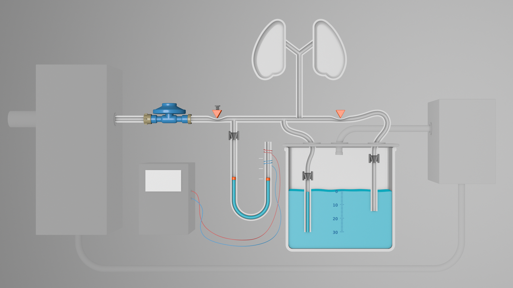

# YACoVV - Yet Another (SARS-)CoV(-2)Ventilator

[German-Version is more Detailed / updated more frequently](README_DE.md) <- Please translate (see Contributing)!

El objetivo de este proyecto es construir grupos de módulos que son necesarios para la construcción de respiradores. Tales aparatos de respiración artificial puedan usarse como dispositivos de „último recurso“ para pacientes infectados con SARS-CoV-2.

Siempre que sea posible, todos los grupos de módulos deben poder fabricarse con componentes, materias primas y habilidades que estén disponibles donde se necesiten los dispositivos.

La parte más compleja de un respirador es la regulación correcta, confiable y segura de la presión de ventilación asi también de la presión positiva al final de la espiración (PEEP). Actualmente existe un enfoque prometedoro para la regulación de presión que ya se ha creado en un modelo.

Los grupos de módulos planificados son:

- [Reguladores de presión y sincronización](#Reguladores%20de%20presión%20y%20sincronización)
    - Regulación de la presión de ventilación ajustable
    - Mantenimiento de la presión positiva al final de la expiración (PEEP) ajustable
    - Regulación de la frecuencia de ventilación ajustable
Regulación de la relación entre la inspiración y la expiración

- [Tratamiento del gas de respiración](#Tratamiento%20del%20gas%20de%20respiración)
    - Mezcla de oxígeno
    - Recuperación
        - Absorbedor de dióxido de carbono
    - Calefactor
    - Humectador
- [Supervisión](#Supervisión)
    - Medición del volumen
    - Medición de presión
    - Medición de frecuencia

[miro-Board](https://miro.com/app/board/o9J_kuxCsRI=/) (Colección de ideas y enlaces)

## Reguladores de presión y sincronización

### Un vídeo de un prototipo

Las problemas con este prototipo:
- [Faltan las válvulas de retención](https://github.com/auenkind/YACoVV/issues/3)
- [Las burbujas de aire en las mangueras de salida son demasiado grandes](https://github.com/auenkind/YACoVV/issues/1)
- [Control de servo / microcontrolador](https://github.com/auenkind/YACoVV/issues/2)

### Principio operacional

El control de presión funciona mediante el principio simple y seguro de la columna de agua. Para generar presiones ajustables en el sistema, las mangueras se sumergen en agua a una profundidad correspondiente a la presión deseada. Al mismo tiempo, las mangueras de control funcionan como una válvula de sobrepresión. Los „caminos de retorno“ de las columnas de agua están asegurados con válvulas de retención para que no pueda llegar agua al paciente.

Dado que las altas presiones de entrada solo pueden regularse con este sistema con componentes muy precisos, utilizamos un regulador de presión de gas de 50 mBar para preregular la presión. Dado que estos reguladores están disponibles en grandes cantidades en todo el mundo, representan una solución ideal para nuestro problema.

Utilizamos el principio de las [válvulas de manguito porque](https://www.ako-armaturen.de/produkte/mechanische-schlauchquetschventile.html) tales válvulas pueden ensamblarse fácilmente a partir de una variedad de componentes ampliamente disponibles. Además, este tipo de válvula ofrece la ventaja de reemplazar fácilmente todos los componentes que entran en contacto con el gas contaminado.

Se realiza la regulación de sincronización en el prototipo acutal a través de un microcontrolador y dos servos. Esta solución será reemplazada por un motor de limpiaparabrisas con dos discos de levas.

#### Inhalación

#### Exhalación

[Animation](https://autode.sk/3dx6EbZ)

## Tratamiento del gas de respiración
Este grupo de módulo recupera el gas de respiración exhalado. Debe ser posible de absorber dióxido de carbono y de agregar oxígeno.

## Supervisión
Este grupo de módulo monitorea el nivel de presión, la presión del péndulo y la frecuencia durante la ventilación.

## ¿Cómo puedo apoyar el proyecto?
¡Estamos contentos con cada contribución al proyecto! Todo tiene que suceder AHORA. ¡No solo piense en contribuir, hágalo!

Si el resultado de este proyecto gana premios en concursos como el [Code Life Ventilator Challenge](https://www.agorize.com/en/challenges/code-life-challenge?lang=en), se utilizarán para construir los componentes o mejorar el diseño.

Cosas que todos pueden contribuirse actualmente:

- Traduzca el README_DE.md (archivo actual) a tantos idiomas como sea posible. El archivo cambiará muy rápidamente y los cambios deben traducirse lo más rápido posible.
- Construya un YACoVV y déjelo correr. Sería genial recibir comentarios sobre los materiales que se pueden usar y sobre las problemas que surgen durante la construcción.
- Aborde un tema específico de las problemas mencionadas y así ayude a avanzar el proyecto.
